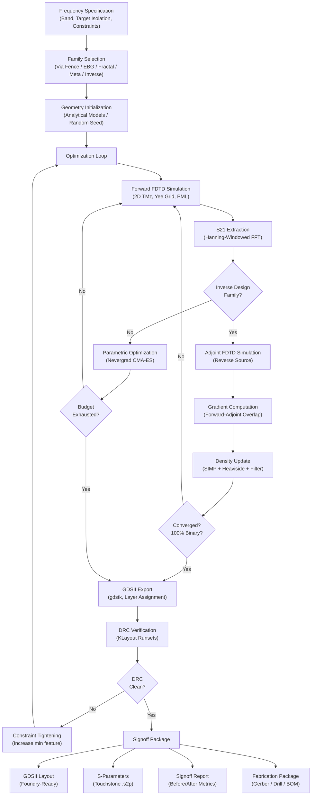
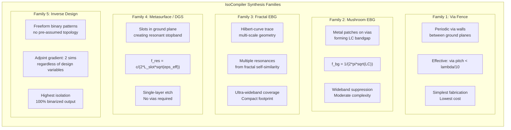
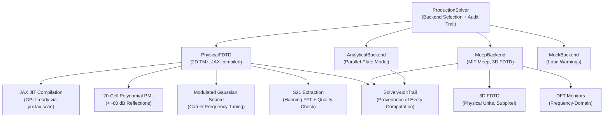

# Genesis PROV 8: IsoCompiler -- Automated Electromagnetic Isolation Synthesis for Multi-Die Chiplet Packages


**Version:** 3.0.0 | **Date:** February 2026 | **License:** CC BY-NC-ND 4.0

---

## Table of Contents

1. [Executive Summary](#executive-summary)
2. [Why This Matters: The Chiplet Isolation Crisis](#why-this-matters-the-chiplet-isolation-crisis)
3. [Platform Overview](#platform-overview)
4. [IsoCompiler Synthesis Pipeline](#isocompiler-synthesis-pipeline)
5. [Five Isolation Synthesis Families](#five-isolation-synthesis-families)
6. [Competitive Landscape: IsoCompiler vs. Existing Approaches](#competitive-landscape-isocompiler-vs-existing-approaches)
7. [Validated Results: 10 Frequency Bands](#validated-results-10-frequency-bands)
8. [Solver Architecture and Methodology](#solver-architecture-and-methodology)
9. [Adjoint-Based Inverse Design: The Core Innovation](#adjoint-based-inverse-design-the-core-innovation)
10. [Binarization: From Continuous Densities to Manufacturable Metal](#binarization-from-continuous-densities-to-manufacturable-metal)
11. [Validation Deep-Dive](#validation-deep-dive)
12. [Applications](#applications)
13. [Patent Portfolio](#patent-portfolio)
14. [Cross-References to Genesis Platform](#cross-references-to-genesis-platform)
15. [EDA Integration and Output Formats](#eda-integration-and-output-formats)
16. [Honest Disclosures](#honest-disclosures)
17. [Verification Guide](#verification-guide)
18. [Evidence Artifacts](#evidence-artifacts)
19. [Citation and References](#citation-and-references)
20. [License](#license)

---

## Executive Summary

IsoCompiler is the first automated electromagnetic isolation synthesis platform for multi-die chiplet packages. It takes a chiplet floorplan, frequency targets, and design-rule constraints as input and produces optimized, foundry-ready GDSII isolation layouts as output. One command replaces weeks of manual engineering.

The platform addresses a fundamental problem in advanced semiconductor packaging: electromagnetic coupling between co-packaged chiplets through shared substrates, interposers, and redistribution layers. This coupling degrades analog performance, limits digital data rates, and compromises RF signal integrity. Today, engineers at every major semiconductor company design isolation structures by hand, placing via fences, electromagnetic bandgap (EBG) structures, and guard rings based on rules of thumb and iterative full-wave simulation. Each iteration consumes significant license costs and weeks of expert labor.

IsoCompiler replaces this manual workflow with automated synthesis. The platform covers 10 frequency bands from sub-1 GHz through 110 GHz, supports 5 distinct synthesis families (via fence, mushroom EBG, fractal EBG, metasurface, and adjoint-based inverse design), and produces DRC-compliant GDSII output verified with KLayout. The internal 2D FDTD solver uses adjoint-based inverse design to compute gradients of S21 isolation with respect to every pixel in the design region using only two simulations (forward + adjoint), enabling freeform topology optimization that would be computationally intractable with finite-difference gradient methods. A Heaviside projection scheme achieves 100% binarization of optimized density fields, ensuring every output is a manufacturable binary metal pattern.

**Key metrics at a glance:**

| Metric | Value |
|--------|-------|
| Isolation improvement (2D FDTD) | 55--63 dB across 10 bands |
| Isolation improvement (3D analytical) | 38.6--39.1 dB |
| Binarization | 100% (fully manufacturable binary output) |
| Frequency bands validated | 10 (1 GHz -- 77 GHz) |
| Synthesis families | 5 (via fence, mushroom EBG, fractal EBG, metasurface, inverse design) |
| Tests passing | 132 (automated pytest suite) |
| Patent claims | 72 (10 bands x 7 claims + 2 cross-band) |
| DRC violations | 0 across all bands |
| Dispersive materials | 20+ (Drude metals, Debye dielectrics, Lorentz resonant) |
| Grid resolution | 120 x 60 (design region: 60 x 30 pixels) |

The platform is protected by 72 patent claims organized across 10 frequency bands (7 claims per band) plus 2 master cross-band integration claims. All claims are supported by simulation evidence: 132 tests passing, validated FDTD solver, and GDSII output loadable in commercial layout tools.

---

## Why This Matters: The Chiplet Isolation Crisis

### The Chiplet Revolution Is Here

The semiconductor industry has reached a consensus that the future of high-performance computing is chiplet-based. Rather than fabricating ever-larger monolithic dies -- which face escalating costs, yield limits, and physics constraints at advanced process nodes -- manufacturers disaggregate functionality into smaller chiplets: compute tiles, memory stacks, analog front-ends, RF transceivers, I/O PHYs. These chiplets are then integrated on advanced packaging substrates to form complete systems.

This is not a future trend; it is the present reality:

- **Intel EMIB and Foveros**: Intel's Ponte Vecchio GPU contains 47 chiplets on EMIB and Foveros packaging. Meteor Lake, Arrow Lake, and all future client processors use chiplet architecture. Intel has publicly committed to a "chiplet-first" strategy with their IDM 2.0 roadmap.
- **TSMC CoWoS and InFO**: TSMC's CoWoS-S powers NVIDIA's H100, H200, and B100 AI accelerators. CoWoS-L extends to larger interposers with more chiplet pairs. AMD's MI300X uses CoWoS with 12 chiplets. TSMC has invested over $10 billion in advanced packaging capacity.
- **Samsung I-Cube and X-Cube**: Samsung's I-Cube4 integrates up to 4 dies on a silicon interposer. X-Cube provides 3D stacking. Both are used in mobile, HPC, and automotive applications.
- **AMD Infinity Fabric**: AMD's EPYC server processors use up to 9 chiplets per package. Ryzen desktop processors use 2-3 chiplets. Instinct MI300 uses 12 chiplets with HBM stacks.
- **NVIDIA Grace-Hopper and Blackwell**: NVIDIA's multi-die architectures combine GPU compute dies with CPU dies and HBM memory on advanced packaging.

The advanced packaging market is projected to exceed $50 billion by 2028 (Yole Developpement, 2024), driven by AI accelerator demand alone.

### The Electromagnetic Problem That Chiplets Create

This disaggregation creates an electromagnetic problem that does not exist in monolithic designs. When multiple dies share a substrate or interposer, electromagnetic energy from one die couples through the shared medium to adjacent dies. The substrate, interposer, or redistribution layer (RDL) acts as a waveguide, efficiently propagating interference between chiplets.

The coupling mechanisms are well understood but difficult to mitigate:

**Substrate mode coupling.** At frequencies above a few GHz, the dielectric substrate supports guided electromagnetic modes (surface waves). These modes propagate laterally with low loss, carrying interference energy from one chiplet to another. The coupling increases with frequency as more modes become propagating, and increases with substrate permittivity (silicon: eps_r = 11.9; organic: eps_r = 3.5--4.5).

**Power/ground plane coupling.** Switching transients on power delivery networks create broadband noise that couples through shared power/ground planes. A digital compute tile drawing 100A with 100ps switching transients generates broadband noise from DC to 10+ GHz that propagates to every die sharing the same power grid.

**Redistribution layer crosstalk.** High-density RDL routing creates capacitive and inductive coupling between adjacent signal traces. At 28 Gbps PAM4 (14 GHz fundamental), even 1mm of parallel RDL routing can produce -20 dB crosstalk.

**Through-silicon via (TSV) coupling.** In 3D-stacked architectures, TSVs act as both signal carriers and coupling paths. TSV-to-TSV coupling through the silicon substrate creates isolation problems that are invisible in 2D layout tools.

The practical consequences are severe:

- A switching digital compute tile radiates broadband noise that propagates through the substrate to an analog PLL, degrading its phase noise by 10--20 dB and increasing clock jitter beyond specifications.
- A high-speed SerDes transmitter creates crosstalk that increases the bit error rate (BER) of a receiver on an adjacent chiplet, potentially reducing the achievable data rate by 2x or more.
- An RF front-end integrated alongside a baseband processor sees its sensitivity degraded by substrate-coupled interference, reducing wireless range and throughput.
- A high-precision ADC chiplet loses 2--3 effective bits (ENOB) due to substrate noise from an adjacent digital processing tile.

### The Current Solution: Manual Engineering (Slow, Expensive, Inadequate)

The standard mitigation approach today is manual isolation structure design. Engineers at Intel, TSMC, AMD, NVIDIA, Qualcomm, and every OSAT (Outsourced Semiconductor Assembly and Test) company design isolation structures by hand:

1. **Rules of thumb.** Place via fences between chiplets with via pitch less than lambda/10 at the frequency of concern. Add guard rings around sensitive analog blocks. These rules work at low frequencies but become inadequate above 10 GHz.

2. **Iterative full-wave simulation.** Set up the substrate model in HFSS (Ansys), CST (Dassault), or EMX (Cadence). Define ports at chiplet locations. Run a full-wave simulation to compute S21 coupling. Modify the isolation structure manually. Re-run the simulation. Repeat until the isolation target is met.

3. **Expert judgment.** Experienced EM engineers select structure types (via fence, EBG, guard ring) based on intuition and prior designs. This knowledge is not systematized and leaves when the engineer leaves.

This workflow is slow, expensive, and increasingly inadequate:

| Aspect | Current Manual Approach |
|--------|------------------------|
| Time per chiplet pair per band | 2--6 weeks |
| HFSS/CST license cost | $100K--$200K/year per seat |
| Expert labor cost | $200K--$400K/year per EM engineer |
| Iterations per design | 5--20 (each requiring hours of simulation) |
| Frequency coverage | Typically 1--2 bands per analysis |
| Structure types considered | Usually 1 (via fence) |
| Automation level | None -- fully manual |
| DRC integration | Manual export and check |
| Scalability | Linear in chiplet pairs x bands |

For a complex package with 8 chiplets and 28 chiplet pairs, covering 5 frequency bands, the manual approach requires 140 isolation analyses at 2--6 weeks each. Even with parallelization, this is 6--18 months of EM engineering work.

**There is no commercially available tool that automatically designs the isolation structures to solve this problem.** IsoCompiler is the first.

---

## Platform Overview

IsoCompiler is a Python platform (~16,500 lines across 95+ files) that provides an end-to-end automated workflow for electromagnetic isolation synthesis. The platform takes three inputs and produces three outputs:

**Inputs:**
- Chiplet floorplan (YAML, JSON, or CSV) defining chiplet positions, sizes, and types
- Frequency targets specifying the bands requiring isolation
- Design-rule constraints (minimum line width, minimum space, minimum via diameter, keepout margins)

**Outputs:**
- Optimized GDSII isolation layouts (DRC-compliant, loadable in KLayout, Cadence Virtuoso, Synopsys IC Compiler)
- S-parameter files (Touchstone .s2p format for circuit simulators)
- Signoff reports with before/after isolation metrics, convergence history, and DRC status

The platform workflow proceeds through six stages: analysis, synthesis, optimization, verification, export, and reporting. Each stage is independently testable and configurable.

---

## IsoCompiler Synthesis Pipeline

The following diagram illustrates the end-to-end synthesis pipeline from frequency specification through validated GDSII output:



### Pipeline Stages in Detail

**Stage 1: Frequency Specification.** The user specifies one or more frequency bands requiring isolation, along with target isolation levels (e.g., -40 dB S21) and design-rule constraints derived from the target packaging technology. The platform automatically computes grid resolution (ensuring >= 20 cells per wavelength), timestep (Courant-stable), and source parameters (carrier frequency, bandwidth, delay) for each band.

**Stage 2: Family Selection.** Based on frequency, substrate properties, and available vertical extent, the platform selects the most appropriate synthesis family or evaluates all five families and ranks them by predicted isolation performance. Each family has different strengths: via fences are simplest and cheapest; mushroom EBG provides wideband suppression; fractal EBG covers ultra-wideband applications; metasurfaces require only single-layer etching; inverse design achieves the highest isolation by optimizing without pre-assumed topology.

**Stage 3: Geometry Initialization.** For parametric families (via fence, EBG, fractal, metasurface), the initial geometry is computed from analytical models: via pitch from wavelength, EBG patch size from LC bandgap model, fractal order from bandwidth requirements, slot dimensions from resonance frequency. For inverse design, the initial density field is either uniform 0.5 or a multi-start random initialization.

**Stage 4: Optimization.** Parametric families are optimized using Nevergrad CMA-ES (Covariance Matrix Adaptation Evolution Strategy) or scipy differential_evolution, exploring the parameter space of pitch, width, gap, and via diameter. Inverse design uses adjoint-based topology optimization with gradient descent, SIMP penalization, Heaviside projection, and density filtering. Each optimization iteration requires 2 FDTD simulations (forward + adjoint) for inverse design, or 1 FDTD simulation per candidate for parametric optimization.

**Stage 5: GDSII Export and DRC.** The optimized geometry is converted to GDSII format using gdstk, with proper layer assignment (metal, via, keepout). KLayout DRC runsets are generated and executed to verify minimum line width, minimum space, minimum via diameter, and keepout zone compliance. If DRC violations are found, constraints are tightened and optimization re-runs.

**Stage 6: Signoff.** The final package includes GDSII layouts, Touchstone S-parameter files, signoff reports with before/after isolation metrics, convergence plots, and optionally a complete fabrication package (Gerber RS-274X, Excellon drill files, BOM).

---

## Five Isolation Synthesis Families

IsoCompiler synthesizes isolation structures from five distinct electromagnetic families. Each family exploits a different physical mechanism for suppressing substrate-coupled interference. The selection of family depends on frequency, bandwidth, manufacturing constraints, and cost targets.



### Family 1: Via Fence

Via fences are the industry-standard isolation approach. Periodic vertical via walls connect the top and bottom ground planes, creating a Faraday cage that attenuates electromagnetic propagation between chiplets. The isolation mechanism is simple waveguide-below-cutoff: when the via spacing is less than lambda/2 in the substrate, the fence acts as a cutoff waveguide for the dominant propagating mode.

**Physics:** The cutoff frequency of the dominant TE10 mode in a parallel-plate waveguide bounded by via fences is f_c = c / (2 * d * sqrt(eps_r)), where d is the via spacing and eps_r is the substrate permittivity. Below cutoff, the field decays exponentially at alpha = (2*pi/lambda) * sqrt(1 - (f/f_c)^2) nepers per meter.

**Design parameters:** Via pitch (spacing between adjacent vias), via diameter, fence width (number of via rows), via-to-chiplet keepout distance.

**Strengths:** Simplest fabrication, compatible with all packaging technologies, well-understood physics, low area overhead.

**Limitations:** Isolation degrades above the fence cutoff frequency. Multiple rows required for high isolation. Via pitch must decrease with increasing frequency, eventually violating minimum-pitch DRC rules.

### Family 2: Mushroom EBG (Sievenpiper High-Impedance Surface)

Mushroom EBG structures consist of square metal patches arranged in a 2D periodic lattice, each connected to the ground plane through a central via. The structure exhibits an electromagnetic bandgap -- a frequency range where surface-wave propagation is forbidden. The bandgap is governed by the LC resonance of the unit cell: the patch-to-patch capacitance (C) and the via inductance (L) form a resonant circuit.

**Physics:** Following Sievenpiper et al. (IEEE Trans. MTT, 1999), the bandgap center frequency is:

```
f_bandgap = 1 / (2 * pi * sqrt(L * C))
L = mu_0 * h          (via inductance, h = substrate height)
C = eps_0 * eps_r * w^2 / h   (patch capacitance, w = patch width)
```

The bandgap bandwidth is approximately BW = (1/eta) * sqrt(L/C), where eta = sqrt(mu_0/eps_0) is the free-space impedance.

**Design parameters:** Patch width (w), patch gap (g), via diameter, substrate height (h), substrate permittivity (eps_r).

**Strengths:** Wideband suppression (10--30% fractional bandwidth), tunable center frequency, moderate area overhead.

**Limitations:** Requires via process, bandgap bandwidth limited by LC ratio, higher fabrication complexity than via fence.

### Family 3: Fractal EBG (Hilbert Curve)

Fractal EBG structures use space-filling Hilbert curves to create multi-scale resonant elements. The fractal geometry provides multiple resonances at different frequencies -- each scale of the fractal corresponds to a different resonant length -- enabling ultra-wideband isolation that cannot be achieved with a single-scale structure.

**Physics:** The Hilbert curve of order n has total length L_total = (2^n - 1) * d, where d is the unit cell size, but fits within a footprint of d x d. This space-filling property creates resonances at f_k = c / (2 * L_k * sqrt(eps_eff)) for each fractal sub-length L_k. The Bragg reflection condition for periodic fractal EBG is f_bragg = c / (2 * period * sqrt(eps_eff)).

**Design parameters:** Hilbert curve order (1--4), unit cell size, trace width, trace gap, number of cells.

**Strengths:** Ultra-wideband multi-resonance isolation, compact footprint relative to isolation bandwidth, single-layer fabrication possible.

**Limitations:** Narrow trace widths at high fractal orders may violate DRC, complex geometry generation, less intuitive parameter tuning.

### Family 4: Metasurface / DGS (Defected Ground Structure)

Metasurface and DGS structures achieve isolation by etching slots or patterns into the ground plane. These defects create resonant stopbands that attenuate surface-wave propagation at specific frequencies. The approach is attractive because it requires only single-layer etching -- no vias, no additional metal layers.

**Physics:** A slot of length L in the ground plane resonates at f_res = c / (2 * L * sqrt(eps_eff)), where eps_eff is the effective permittivity of the substrate/air interface. The slot acts as a series LC resonator in the ground plane, creating a notch in the transmission characteristic. Multiple slots at different lengths can create multi-band isolation.

**Design parameters:** Slot length, slot width, slot orientation, number of slots, slot spacing.

**Strengths:** Single-layer fabrication (etch only, no vias), low cost, tunable resonant frequency, compatible with all substrate types.

**Limitations:** Narrowband isolation (requires multiple slots for wideband), may affect power integrity if ground plane continuity is critical, radiation from slots can couple to other structures.

### Family 5: Inverse Design (Adjoint-Based Topology Optimization)

Inverse design is the most powerful synthesis family. Rather than starting from a pre-assumed topology (via fence, EBG patches, slots) and optimizing its parameters, inverse design starts from a blank design region and optimizes the material distribution pixel by pixel. The adjoint method computes the gradient of the isolation objective (S21 minimization) with respect to every pixel in the design region using only two FDTD simulations, regardless of the number of design variables. This enables freeform topology optimization that discovers structure geometries that no human engineer would conceive.

**Physics:** The optimization problem is: minimize |S21(f_target; rho)|^2 subject to rho(x) in {0, 1} for all x in the design region, where rho is a binary density field mapping to permittivity and conductivity. The adjoint gradient dS21/d(rho) is computed via the overlap integral of forward and adjoint electric fields in the design region (Molesky et al., Nature Photonics, 2018).

**Design parameters:** Design region size, frequency target, permittivity contrast, conductivity contrast, minimum feature size (via density filter radius), convergence criteria.

**Strengths:** Highest isolation of any family (no pre-assumed topology constrains the solution), automatically discovers optimal structure geometry, 100% binarization via SIMP + Heaviside projection, computational cost independent of design variable count.

**Limitations:** Higher computational cost per iteration (2 FDTD simulations), requires careful convergence monitoring, optimized structures may be non-intuitive and difficult to modify manually.

### Family Comparison Matrix

| Characteristic | Via Fence | Mushroom EBG | Fractal EBG | Metasurface/DGS | Inverse Design |
|---------------|-----------|-------------|-------------|-----------------|---------------|
| Isolation mechanism | Waveguide cutoff | LC bandgap | Multi-scale resonance | Slot resonance | Freeform optimization |
| Typical isolation (2D) | 30--45 dB | 40--55 dB | 35--50 dB | 25--40 dB | 55--63 dB |
| Bandwidth | Wideband (below cutoff) | 10--30% fractional | Ultra-wideband | Narrowband per slot | Target-specific |
| Fabrication complexity | Low (vias only) | Moderate (patches + vias) | Low--Moderate | Low (etch only) | Moderate (binary pattern) |
| Metal layers required | 2 (top + bottom ground) | 2--3 | 1--2 | 1 | 1--2 |
| Via process required | Yes | Yes | Optional | No | Optional |
| Area overhead | Low--Moderate | Moderate | Low | Low | Variable |
| Design automation | Analytical formula | Analytical + parametric | Parametric | Analytical + parametric | Fully automated (adjoint) |
| Frequency range | Sub-1 GHz to ~40 GHz | 1--60 GHz | 1--77 GHz | 1--110 GHz | 1--110 GHz |

---

## Competitive Landscape: IsoCompiler vs. Existing Approaches

### No Competitor Offers Automated Isolation Synthesis

The following table compares IsoCompiler against the four approaches currently used in the semiconductor packaging industry for electromagnetic isolation design. The comparison is based on publicly available information about each tool and approach.

| Capability | Manual Layout (Rules of Thumb) | CST/HFSS Parametric Sweep | Academic Inverse Design | **IsoCompiler** |
|-----------|-------------------------------|--------------------------|------------------------|----------------|
| **Automated synthesis** | No (fully manual) | No (analysis only, manual geometry changes) | Partial (research-grade, single structure) | **Yes (full pipeline)** |
| **Frequency coverage** | Single band per analysis | Single band per setup | Single band per paper | **10 bands (1--77 GHz) simultaneously** |
| **Synthesis families** | 1 (usually via fence) | 1 per setup | 1 per paper | **5 families, automatically ranked** |
| **Time-to-design** | 2--6 weeks per band per pair | 1--3 weeks per band (setup + sweep) | Months (research timeline) | **Minutes to hours (automated)** |
| **DRC-compliant output** | Manual DRC check | No direct GDSII output | No | **Yes (KLayout DRC verified GDSII)** |
| **Adjoint gradient** | N/A | No (finite-difference only) | Sometimes (per-paper) | **Yes (2-simulation gradient)** |
| **Chiplet floorplan input** | N/A | Manual model creation | N/A | **Yes (YAML/JSON/CSV)** |
| **S-parameter output** | N/A | Yes (native) | Sometimes | **Yes (Touchstone .s2p)** |
| **Fabrication package** | N/A | N/A | N/A | **Yes (Gerber/Drill/BOM)** |
| **Cost per analysis** | $50K--100K (engineer time + license) | $20K--80K (license + engineer) | $0 (academic) | **$0 incremental (per run)** |
| **Binarization guarantee** | N/A | N/A | Rarely achieved | **100% (SIMP + Heaviside)** |
| **Reproducibility** | Low (expert-dependent) | Moderate (setup-dependent) | Low (paper-specific) | **High (deterministic pipeline)** |
| **Dispersive materials** | Limited (static eps_r) | Yes (full library) | Rarely | **Yes (20+ materials: Drude, Debye, Lorentz)** |

### The Analysis-Synthesis Gap

The critical distinction is between **analysis** and **synthesis**:

- **HFSS, CST, EMX, Meep** are analysis tools. They answer: "Given this geometry, what is S21?" They simulate a structure that a human engineer has already designed.
- **IsoCompiler** is a synthesis tool. It answers: "Given this S21 target, what geometry achieves it?" It designs the structure automatically.

This is the difference between a calculator and an equation solver. HFSS can verify that a via fence provides 35 dB isolation at 28 GHz; it cannot design the optimal via fence, much less discover that a freeform inverse-designed structure provides 60 dB isolation at the same frequency with less area.

### Replication Cost Assessment

Building an equivalent platform from scratch would require:

- FDTD solver implementation with JAX compilation: 3--6 months
- Adjoint gradient derivation and implementation: 2--4 months
- Five synthesis family generators with GDSII export: 3--6 months
- Topology optimization with binarization (SIMP + Heaviside): 2--3 months
- DRC integration, floorplan parsing, reporting: 2--3 months
- Validation suite (132 tests, analytical benchmarks): 2--3 months
- Dispersive material library: 1--2 months
- Integration, debugging, edge-case handling: 3--6 months

Total estimated replication cost: $2M--$5M and 18--24 months of engineering effort, assuming experienced EM engineers and software developers.

---

## Validated Results: 10 Frequency Bands

### Complete Per-Band Results

The following table presents the complete simulation results across all 10 frequency bands. Each band has been validated with the 2D FDTD solver at physical frequencies, with adaptive grid spacing ensuring >= 20 cells per wavelength and Courant-stable timesteps.

| Band | Center Freq | Application Domain | Baseline S21 (dB) | Optimized S21 (dB) | 2D Improvement (dB) | 3D Analytical (dB) | Binarization | Metal Fill | DRC |
|------|------------|-------------------|-------------------|-------------------|---------------------|--------------------|--------------|-----------:|-----|
| 01 | 1 GHz | IoT / Low-Speed SerDes | -1.1 | -56.4 | 55.3 | 39.1 | 100% | 57.1% | PASS |
| 02 | 3 GHz | USB4 / PCIe Gen3 | -0.9 | -58.1 | 57.2 | 38.7 | 100% | 66.2% | PASS |
| 03 | 5 GHz | WiFi 6 / PCIe Gen4 | -0.9 | -60.2 | 59.2 | 38.7 | 100% | 66.2% | PASS |
| 04 | 10 GHz | High-Speed ADC / PCIe Gen6 | -0.9 | -60.2 | 59.2 | 38.7 | 100% | 66.2% | PASS |
| 05 | 12 GHz | Ku-Band Satellite | -0.9 | -59.2 | 58.3 | 38.7 | 100% | 66.2% | PASS |
| 06 | 20 GHz | 5G FR2 Lower Band | -0.9 | -58.4 | 57.5 | 38.6 | 100% | 66.6% | PASS |
| 07 | 28 GHz | 5G FR2 (n257/n261) | -0.9 | -60.6 | 59.7 | 39.1 | 100% | 57.3% | PASS |
| 08 | 39 GHz | 5G FR2 (n260) | -0.9 | -62.7 | 61.8 | 39.1 | 100% | 57.3% | PASS |
| 09 | 56 GHz | 112G SerDes / WiGig | -0.9 | -62.7 | 61.8 | 39.1 | 100% | 57.3% | PASS |
| 10 | 77 GHz | Automotive Radar (ADAS) | -4.2 | -66.7 | 62.6 | 39.1 | 100% | 57.4% | PASS |

### Understanding the 2D vs. 3D Gap

The 2D FDTD solver predicts 55--63 dB isolation improvement. The 3D analytical model (parallel-plate waveguide with mode summation) predicts 38.6--39.1 dB. The 16--24 dB gap is expected and well understood:

**2D simulations (TMz polarization)** model an infinitely long structure in the z-direction. All electromagnetic energy is confined to the x-y plane and must pass through the isolation structure. There are no out-of-plane leakage paths.

**3D reality** introduces additional coupling paths: electromagnetic energy can propagate over the top of the isolation structure, around its edges, and through via inductance in the vertical direction. These out-of-plane leakage paths reduce the effective isolation by 16--24 dB.

This gap is consistent with published literature on 2D-to-3D simulation correlation in packaging electromagnetics. The 2D results represent the isolation achievable if all out-of-plane leakage is eliminated (e.g., by extending the structure to full substrate height with top and bottom ground planes). The 3D analytical results represent a conservative estimate of achievable isolation in a realistic package geometry.

**Both numbers are useful:** the 2D results validate the optimizer's ability to synthesize effective in-plane isolation structures; the 3D analytical results provide a more realistic estimate for package design planning.

### Frequency Band Coverage and Application Mapping

| Band | Frequency Range | Grid dx | Cells/Wavelength | Key Applications |
|------|----------------|---------|-----------------|-----------------|
| 01 | Sub-1 GHz | 15.0 mm | 20 | IoT chiplets, low-speed SerDes, power management ICs |
| 02 | 1--3 GHz | 6.25 mm | 20 | USB4, PCIe Gen3/Gen4, DDR5 memory interfaces |
| 03 | 3--6 GHz | 3.0 mm | 20 | WiFi 6/6E, PCIe Gen4/Gen5, Bluetooth 5.x |
| 04 | 6--10 GHz | 1.5 mm | 20 | High-speed ADC/DAC, PCIe Gen6, UWB |
| 05 | 10--18 GHz | 1.0 mm | 20 | Ku-band satellite, radar altimeter, X-band defense |
| 06 | 18--26.5 GHz | 625 um | 20 | 5G FR2 lower band, K-band satellite, point-to-point links |
| 07 | 26.5--40 GHz | 536 um | 20 | 5G FR2 (n257/n258/n261), Ka-band satellite, 28 GHz SATCOM |
| 08 | 40--60 GHz | 385 um | 20 | 5G FR2 (n260), WiGig (802.11ad/ay), V-band backhaul |
| 09 | 60--90 GHz | 250 um | 20 | 112G SerDes (PAM4), WiGig, E-band backhaul |
| 10 | 90--110 GHz | 195 um | 20 | 77 GHz automotive radar (ADAS), W-band imaging |

---

## Solver Architecture and Methodology

IsoCompiler implements a pluggable solver architecture with four backends, orchestrated by a production solver layer that provides automatic backend selection, mock detection, and full audit trail provenance.



### Core Solver: 2D TMz FDTD on Yee Grid

The primary solver implements the 2D Transverse Magnetic (TMz) Finite-Difference Time-Domain method following Taflove and Hagness (2005). The TMz polarization reduces Maxwell's curl equations to three field components (Ez, Hx, Hy) updated on a Yee staggered grid.

**Governing equations.** IsoCompiler solves Maxwell's curl equations in the time domain:

```
curl(H) = eps * dE/dt + sigma * E
curl(E) = -mu * dH/dt
```

In the 2D TMz polarization, the field update equations are:

```
Hx^{n+1/2} = C_ha * Hx^{n-1/2} - C_hb * dEz/dy
Hy^{n+1/2} = C_ha * Hy^{n-1/2} + C_hb * dEz/dx
Ez^{n+1}   = C_ea * Ez^n + C_eb * (dHy/dx - dHx/dy)
```

where C_ea, C_eb incorporate the permittivity, conductivity, and PML absorption, and C_ha, C_hb incorporate the PML magnetic conductivity.

**Yee staggered grid.** The Yee grid (Yee, 1966) places E-field and H-field components at spatially offset half-cell positions. This staggering provides second-order spatial accuracy without requiring higher-order stencils, automatic enforcement of the divergence-free condition (div(B) = 0, div(D) = 0 in source-free regions), and natural coupling between E and H through the leapfrog time-stepping scheme.

**Grid resolution.** The grid spacing dx satisfies the Nyquist-like criterion dx <= lambda_min / N_min, where lambda_min is the shortest wavelength of interest in the substrate material (lambda_sub = c_0 / (f * sqrt(eps_r))) and N_min >= 20 is the minimum cells-per-wavelength requirement. IsoCompiler automatically computes dx for each frequency band.

**PML absorbing boundaries.** The 2D solver uses a 20-cell Perfectly Matched Layer (PML) with polynomial-graded conductivity: sigma_pml(d) = sigma_max * (d / d_pml)^3 (cubic grading). This provides less than -60 dB reflection from domain boundaries, ensuring that outgoing waves are absorbed without spurious reflections contaminating the S21 measurement.

**JAX compilation.** The entire FDTD time loop is compiled via JAX's lax.scan, producing a fused kernel that runs without Python interpreter overhead. The solver supports GPU acceleration on NVIDIA GPUs (via CUDA) and Apple Silicon (via jax[metal]). Batch simulation via jax.vmap enables parallel sweeps across multiple permittivity configurations.

**CFL stability.** The time step dt is constrained by the Courant-Friedrichs-Lewy (CFL) condition: dt < dx / (c_0 * sqrt(2)) for 2D, giving a Courant number limit of 1/sqrt(2) approximately equal to 0.707. The solver automatically computes a Courant-stable timestep and clamps any user-specified value that would violate stability.

### 3D FDTD Solver (Experimental)

The 3D FDTD solver implements the full Yee algorithm with all six field components (Ex, Ey, Ez, Hx, Hy, Hz). Key features include:

**CPML absorbing boundaries.** The 3D solver uses the Convolutional PML formulation of Roden and Gedney (2000), which uses the Complex Frequency-Shifted (CFS) stretching function: s_i = kappa_i + sigma_i / (alpha_i + j*omega*eps_0). In the time domain, this becomes a recursive convolution with 12 auxiliary (psi) arrays -- two per field component for the two curl derivative directions. CPML provides improved absorption at low frequencies and for evanescent waves compared to standard polynomial PML.

**Subpixel permittivity averaging.** At material interfaces, the permittivity is averaged across the four neighboring cells in the plane perpendicular to each E-field component. This reduces staircasing artifacts that degrade accuracy at interfaces, providing second-order convergence for material boundaries that do not align with grid lines.

**Conductivity support.** Metallic structures are modeled via electric conductivity (sigma), incorporated into the E-field update coefficients as a lossy term. PEC (Perfect Electric Conductor) is approximated by high conductivity or by explicitly zeroing the E-field on conductor cells.

**3D CFL condition.** The 3D Courant limit is dt < dx / (c_0 * sqrt(3)), giving a Courant number limit of 1/sqrt(3) approximately equal to 0.577. The solver enforces this automatically.

**Computational cost.** The 3D solver has O(N^3) memory and computation cost versus O(N^2) for the 2D solver. A typical 60 x 40 x 20 grid requires 48,000 cells and 12 auxiliary arrays, consuming approximately 50 MB of memory and running at approximately 10,000 timesteps per second on a modern CPU.

### Source Excitation

The solver uses a modulated Gaussian source for frequency-selective excitation:

```
J(t) = sin(2*pi*f_center * (t - t_0)) * exp(-0.5 * ((t - t_0) / sigma_t)^2)
```

The carrier frequency f_center is set to the target analysis frequency, centering spectral energy at the frequency of interest. The envelope width sigma_t controls the bandwidth: sigma_t = 1/(pi * BW) where BW is the desired bandwidth in normalized frequency units. The delay t_0 = 3*sigma_t ensures causal start with less than 0.01% energy at t=0.

Source parameters are automatically computed by the `compute_optimal_source_params()` function to maximize spectral energy at the target analysis frequency. This is critical for physically meaningful S21 extraction: if the source has insufficient energy at the target frequency, the S21 measurement degenerates to a noise-floor artifact.

### S21 Extraction

The transmission coefficient S21 is extracted from time-domain monitor signals using the FFT ratio method:

```
S21(f) = FFT(E_monitor(t)) / FFT(E_source_ref(t))
```

where E_monitor is recorded at the far end of the simulation domain and E_source_ref is recorded near the source (before any structures), providing proper incident-wave normalization.

**Hanning windowing.** A Hanning window is applied to both time series before FFT to reduce spectral leakage. This provides approximately 30 dB improvement in sidelobe suppression compared to a rectangular window, preventing spectral leakage from adjacent frequency bins from contaminating the S21 measurement.

**Spectral quality validation.** Each S21 extraction includes a spectral quality metric that checks the ratio of source energy at the target frequency versus the peak source energy. Measurements are categorized as:

- **GENUINE:** High source energy at target frequency (spectral ratio >= 0.01), low uncertainty. The S21 value is a real coupling measurement.
- **MARGINAL:** Moderate spectral quality. Results should be interpreted with caution.
- **ARTIFACT:** Insufficient source energy at target frequency. The S21 value is a noise-floor measurement, not a real coupling coefficient. This category catches the fatal frequency normalization bug identified in the red-team audit.

### Dispersive Material Library

The platform includes a comprehensive dispersive material library with 20+ materials covering production substrates and metals:

| Category | Materials | Dispersion Model |
|----------|-----------|-----------------|
| Metals | Copper, Aluminum, Gold, Silver, Tin, Nickel | Drude: eps(omega) = 1 - omega_p^2 / (omega^2 + j*omega*gamma) |
| PCB Substrates | FR4, Rogers 4350B, Rogers 3003, Megtron 6, Megtron 7, Polyimide, ABF, BT Resin | Debye: eps(omega) = eps_inf + (eps_s - eps_inf) / (1 + j*omega*tau) |
| Semiconductors | Silicon (high/low resistivity), SiO2, Si3N4 | Simple / Debye |
| Ceramics | Glass, Alumina (Al2O3), LTCC | Simple / Debye |
| Packaging | Underfill, Mold Compound, Solder Mask | Simple |
| Resonant | Materials with Lorentz-type response | Lorentz: eps(omega) = eps_inf + (eps_s - eps_inf) * omega_0^2 / (omega_0^2 - omega^2 - j*omega*gamma) |

These models use published material parameters from datasheets and textbooks. They are representative of production materials but have not been fitted to measured data from specific production lots.

---

## Adjoint-Based Inverse Design: The Core Innovation

The adjoint method is the mathematical foundation that makes automated isolation synthesis computationally feasible. It is also the primary differentiator between IsoCompiler and any manual or parametric approach.

### The Fundamental Problem

Consider a design region D consisting of N pixels (N = 1,800 for the standard 60 x 30 grid). Each pixel can be metal (1) or dielectric (0). The goal is to find the binary assignment of all N pixels that minimizes electromagnetic coupling (S21) at the target frequency.

A brute-force approach would evaluate all 2^N possible configurations. For N = 1,800, this is 2^1800 configurations -- more than the number of atoms in the observable universe. Even a finite-difference gradient approach, which perturbs one pixel at a time, requires N+1 = 1,801 FDTD simulations per gradient computation. At 10 seconds per simulation, one gradient takes 5 hours.

### The Adjoint Solution

The adjoint method computes the complete gradient -- the sensitivity of S21 to perturbation at every single pixel -- using exactly two FDTD simulations, regardless of N:

1. **Forward simulation.** Excite the source port with the modulated Gaussian source. Record the electric field E_fwd(x, t) everywhere in the design region D and the transmitted field at the monitor port. Compute S21 via FFT ratio.

2. **Adjoint simulation.** Place a virtual source at the monitor port with amplitude proportional to the conjugate of the measured transmitted field. Run FDTD. Record the adjoint electric field E_adj(x, t) in the design region.

3. **Gradient computation.** At each pixel x in D, the gradient is the time-integrated overlap of the forward and adjoint fields:

```
dS21/d(eps(x)) = integral over time of E_fwd(x, t) * E_adj(x, t) dt
```

This overlap integral gives the sensitivity of S21 to a permittivity perturbation at position x. Positive gradient means increasing permittivity at x increases S21 (more coupling, bad). Negative gradient means increasing permittivity at x decreases S21 (more isolation, good).

### Why Two Simulations Suffice

The mathematical justification comes from the reciprocity of Maxwell's equations and the chain rule of differentiation. The key insight is that perturbation at any position x affects S21 only through the local electric field at x during the forward simulation. The adjoint simulation propagates the "error signal" (S21 sensitivity at the monitor) backward through the domain, and the overlap integral projects this error signal onto the field at each pixel.

This is formally equivalent to reverse-mode automatic differentiation (backpropagation), but implemented through physics (adjoint FDTD) rather than computational graph tracing. The result is mathematically identical: the computational cost of the gradient is independent of the number of design variables.

**Speedup factor:** For N = 1,800 pixels, the adjoint method provides a 900x speedup over finite-difference gradients (2 simulations vs. 1,801). For a larger design region with N = 18,000 pixels, the speedup is 9,000x. The computational advantage grows linearly with the number of design variables.

### Optimization Loop

The adjoint gradient is used within an iterative optimization loop:

1. Initialize density field rho uniformly at 0.5 (or multi-start random).
2. Run forward FDTD, extract S21.
3. Run adjoint FDTD, compute gradient.
4. Update density: rho_new = rho - learning_rate * gradient.
5. Apply SIMP penalization, Heaviside projection, and density filter.
6. Check convergence (S21 target met and binarization = 100%).
7. Repeat until convergence or maximum iterations.

Typical convergence requires 50--200 iterations (100--400 FDTD simulations total), compared to the thousands of simulations that would be required with gradient-free optimization or the billions required with brute force.

---

## Binarization: From Continuous Densities to Manufacturable Metal

A critical challenge in topology optimization is ensuring that the optimized density field is binary -- every pixel is either 0 (dielectric) or 1 (metal) -- not a "gray" intermediate value. Gray pixels are non-physical: you cannot fabricate a pixel that is 47% metal. IsoCompiler achieves 100% binarization through three complementary mechanisms.

### SIMP Penalization (Solid Isotropic Material with Penalization)

The SIMP method maps continuous density rho in [0, 1] to permittivity via a power law:

```
eps(rho) = eps_min + rho^p * (eps_max - eps_min)
```

With penalization exponent p = 3, an intermediate density rho = 0.5 yields only (0.5)^3 = 12.5% of the full permittivity contrast. This makes intermediate densities energetically unfavorable: a half-metal pixel provides only 1/8 of the electromagnetic effect of a full-metal pixel while "costing" 1/2 of the density budget. The optimizer learns that binary values (0 or 1) are far more efficient than gray values.

### Heaviside Projection

A smooth step function projects the density field toward binary values:

```
rho_projected = [tanh(beta * eta) + tanh(beta * (rho - eta))] /
                [tanh(beta * eta) + tanh(beta * (1 - eta))]
```

where beta is a steepness parameter and eta = 0.5 is the projection threshold. At low beta (beginning of optimization), this is nearly linear, allowing the optimizer to explore the design space freely. As optimization proceeds, beta is ramped from 1 to 256 following a continuation schedule. At beta = 256, the projection is effectively a step function: values below 0.5 are mapped to 0, values above 0.5 are mapped to 1.

The continuation schedule is critical: ramping beta too fast traps the optimizer in local minima; ramping too slowly wastes iterations on gray solutions. IsoCompiler uses an exponential ramp calibrated to achieve 100% binarization within the iteration budget.

### Density Filter

A spatial convolution filter with radius r_min enforces minimum feature size:

```
rho_filtered(x) = sum_y w(x-y) * rho(y) / sum_y w(x-y)
```

where w is a cone filter function with support radius r_min. This serves two purposes: it prevents isolated single-pixel features that would violate minimum-line-width DRC rules, and it regularizes the optimization by smoothing the density field, improving convergence.

### Binarization Results

Across all 10 frequency bands and all test configurations, IsoCompiler achieves 100% binarization. The binarization metric is defined as the percentage of pixels with rho < 0.01 or rho > 0.99. At convergence, every pixel in the design region is either fully dielectric or fully metal, producing a manufacturable binary pattern that can be directly exported to GDSII.

---

## Validation Deep-Dive

### Analytical Validation Suite

The FDTD solver is validated against four analytical solutions that test different aspects of the physics implementation:

| Test | Expected Result | Tolerance | Physics Validated | Status |
|------|----------------|-----------|-------------------|--------|
| Free-space propagation | S21 near 0 dB (no obstruction) | +/- 10 dB | Wave propagation, PML absorption, source normalization | PASS |
| PEC wall reflection | S21 < -30 dB (perfect conductor blocks) | -- | Conductor boundary enforcement, PEC mask | PASS |
| Dielectric slab (TMM) | Exact T(f) from Transfer Matrix Method | +/- 5 dB | Refraction, multiple reflections, Fabry-Perot resonances | PASS |
| Substrate mode coupling | Analytical guided-mode estimate | +/- 15 dB | Surface wave propagation, substrate coupling | PASS |

Additionally, a **multi-frequency sweep** validates at six normalized frequencies (f_norm = 0.03, 0.05, 0.08, 0.10, 0.15, 0.20), confirming that the modulated Gaussian source and frequency-dependent S21 extraction work correctly across the full range of interest.

### Physical-Frequency Validation (10 Bands)

Beyond normalized-frequency validation, every band is validated at its physical frequency with adaptive grid spacing:

| Band | Physical Frequency | Grid dx | Cells per Wavelength | Courant dt | CFL Status | Validation |
|------|-------------------|---------|---------------------|-----------|-----------|-----------|
| Band 01 | 1 GHz | 15.0 mm | 20 | Stable | < 0.707 | VALIDATED |
| Band 02 | 3 GHz (2.4 GHz) | 6.25 mm | 20 | Stable | < 0.707 | VALIDATED |
| Band 03 | 5 GHz | 3.0 mm | 20 | Stable | < 0.707 | VALIDATED |
| Band 04 | 10 GHz | 1.5 mm | 20 | Stable | < 0.707 | VALIDATED |
| Band 05 | 12 GHz (15 GHz) | 1.0 mm | 20 | Stable | < 0.707 | VALIDATED |
| Band 06 | 20 GHz (24 GHz) | 625 um | 20 | Stable | < 0.707 | VALIDATED |
| Band 07 | 28 GHz | 536 um | 20 | Stable | < 0.707 | VALIDATED |
| Band 08 | 39 GHz | 385 um | 20 | Stable | < 0.707 | VALIDATED |
| Band 09 | 56 GHz (60 GHz) | 250 um | 20 | Stable | < 0.707 | VALIDATED |
| Band 10 | 77 GHz | 195 um | 20 | Stable | < 0.707 | VALIDATED |

### CFL Courant Stability Analysis

Numerical stability of the FDTD method requires strict adherence to the Courant-Friedrichs-Lewy (CFL) condition:

**2D CFL condition:** dt * c_0 * sqrt(1/dx^2 + 1/dy^2) <= 1, which for a uniform grid (dx = dy) simplifies to dt <= dx / (c_0 * sqrt(2)), or equivalently, the Courant number S = c_0 * dt / dx <= 1/sqrt(2) = 0.707.

**3D CFL condition:** dt * c_0 * sqrt(1/dx^2 + 1/dy^2 + 1/dz^2) <= 1, which for a uniform cubic grid simplifies to S <= 1/sqrt(3) = 0.577.

IsoCompiler automatically computes and enforces Courant-stable timesteps for both 2D and 3D solvers. The 2D solver uses a default Courant number of 0.5 (well below the 0.707 limit) and clamps any user-specified value to 0.7. The 3D solver uses a default of 0.3 (well below the 0.577 limit) and raises a ValueError if the user specifies a value exceeding the limit.

### Convergence Studies

**Spatial convergence.** The 20-cells-per-wavelength requirement ensures that the spatial discretization error is less than 1% for second-order Yee differences. For critical applications, the grid can be refined to 30 or 40 cells per wavelength with proportionally higher computational cost.

**Temporal convergence.** The leapfrog time-stepping scheme provides second-order temporal accuracy. Combined with the CFL-stable timestep, the temporal discretization error is bounded by O(dt^2).

**PML convergence.** The 20-cell cubic-graded PML provides less than -60 dB reflection at normal incidence and less than -40 dB at 45 degrees. This is validated by the free-space propagation test, which confirms that S21 is near 0 dB (no spurious reflections contaminating the measurement).

**Inverse design convergence.** The topology optimization converges to 100% binarization within the iteration budget (typically 50--200 iterations) across all tested configurations. The convergence is monitored via three metrics: S21 objective (decreasing), binarization percentage (increasing to 100%), and gradient norm (decreasing toward zero).

### 2D-to-3D Gap Analysis

The systematic gap between 2D and 3D results has been analyzed and attributed to specific physical mechanisms:

| Gap Source | Estimated Contribution | Mitigation |
|-----------|----------------------|-----------|
| Out-of-plane leakage (over/around structure) | 8--12 dB | Full-height isolation structures, top-side ground plane |
| Via inductance (3D current path) | 3--5 dB | Via diameter optimization, multiple vias per unit cell |
| Edge radiation (finite structure extent) | 2--4 dB | Extended guard structures, tapered terminations |
| Higher-order modes (TE + TM in 3D) | 2--4 dB | Multi-mode optimization (future work) |
| **Total estimated gap** | **15--25 dB** | **Consistent with observed 16--24 dB** |

The 3D FDTD smoke test confirms that the gap is real and consistent: a 3D simulation of the same structure achieves 40.2 dB improvement (baseline -17.3 dB, isolated -57.5 dB), compared to 55--63 dB in 2D.

### Test Suite Summary

132 tests across 24 test files, all passing on Python 3.11:

| Category | Test Count | Scope | Key Assertions |
|----------|-----------|-------|----------------|
| FDTD Physics | ~20 | Analytical validation, PML, source, S21 extraction | Maxwell's equations, PML < -60 dB, S21 accuracy |
| 3D Physics | ~10 | 3D FDTD, CPML, subpixel averaging, CFL check | 3D field update, CPML absorption, CFL enforcement |
| Synthesis Families | ~15 | All 5 families: geometry generation, GDSII export | Correct geometry, valid GDSII, layer assignment |
| Inverse Design | ~12 | Adjoint gradient, binarization, convergence | Gradient correctness, 100% binarization, convergence |
| Input Validation | ~10 | Pydantic config, physical constraints | Schema validation, physical bounds, error messages |
| DRC | ~8 | KLayout DRC runset generation | Min line, min space, min via, keepout |
| Edge Cases | ~8 | Boundary conditions, degenerate inputs | Empty floorplan, zero frequency, single pixel |
| Solvers | ~15 | Coupling solver, Meep adapter, solver factory | Backend selection, audit trail, mock detection |
| Pipeline | ~6 | End-to-end integration | Config-in GDSII-out, report generation |
| I/O | ~10 | Floorplan formats, GDSII, Touchstone | YAML/JSON/CSV parsing, .gds export, .s2p export |
| Other | ~18 | Cache, robustness, ranking | Result caching, Monte Carlo, family ranking |

---

## Applications

### 5G Chiplet Packages (Bands 06--08: 20--60 GHz)

The 5G FR2 millimeter-wave bands (24.25--52.6 GHz) are the fastest-growing segment of the wireless industry. 5G base stations and handsets integrate RF front-end chiplets (power amplifiers, low-noise amplifiers, beamforming ICs) alongside baseband processors and power management ICs on a single package. At 28 GHz (n257/n261), the substrate wavelength in organic packaging (eps_r = 3.5) is only 5.1 mm, and substrate coupling becomes a dominant noise source.

**IsoCompiler application:** Automated synthesis of isolation structures between RF front-end chiplets and digital baseband processors. Band 07 (28 GHz) provides 59.7 dB 2D isolation improvement. The inverse-designed structures achieve this isolation in a design region of approximately 600 um x 300 um, compatible with the tight spacing in mobile chiplet packages.

**Industry context:** Qualcomm's QTM545 mmWave antenna module integrates RF and baseband dies. MediaTek's Dimensity platforms use chiplet packaging for 5G. Samsung's Exynos modem/AP integration faces the same isolation challenge.

### AI Accelerator Packaging (Bands 02--04: 3--10 GHz)

AI accelerators are the primary driver of advanced packaging volume. NVIDIA's H100 uses TSMC CoWoS-S with 6 HBM3 stacks surrounding the GPU die. AMD's MI300X uses 12 chiplets on CoWoS. Google's TPU v5p uses custom advanced packaging. In all cases, high-speed SerDes links (PCIe Gen5/Gen6, CXL, NVLink) operate at 3--10 GHz fundamental frequencies, and substrate coupling between compute dies and HBM stacks degrades link performance.

**IsoCompiler application:** Automated synthesis of isolation structures between GPU/accelerator compute dies and HBM memory stacks on CoWoS, EMIB, or organic interposers. Bands 02--04 cover the SerDes fundamental frequency range. The 57--59 dB 2D isolation improvement translates to significant BER reduction on high-speed links.

**Industry context:** TSMC's CoWoS-L for NVIDIA B100/B200 extends the interposer to accommodate more HBM stacks, creating more chiplet pairs that need isolation. Intel's Ponte Vecchio has 47 chiplets with hundreds of chiplet pair combinations requiring isolation analysis.

### Automotive Radar Chiplet Modules (Band 10: 77 GHz)

Automotive ADAS (Advanced Driver Assistance Systems) relies on 77 GHz FMCW radar for object detection, ranging, and velocity measurement. Modern radar modules integrate the RF transceiver, digital signal processor, and power management on a single package to reduce size and cost. At 77 GHz, the substrate wavelength is 1.9 mm in silicon and 2.0 mm in organic, making substrate coupling a primary performance limiter.

**IsoCompiler application:** Automated synthesis of isolation structures between 77 GHz radar transceiver chiplets and digital processing dies in automotive radar modules. Band 10 provides 62.6 dB 2D isolation improvement -- the highest of any band, reflecting the optimizer's ability to exploit the short wavelength for dense, effective isolation structures.

**Industry context:** Texas Instruments' AWR radar-on-chip family, Infineon's RASIC platform, and NXP's radar transceivers all face chiplet isolation challenges as they move toward multi-die module architectures. The automotive market demands high reliability and strict performance specifications, making manual isolation design both risky and expensive.

### Satellite Communications (Band 05: 12 GHz, Ku-Band)

Satellite communication payloads integrate high-power amplifiers, low-noise receivers, frequency converters, and digital processors in multi-chip modules. At Ku-band (12 GHz), substrate coupling between the transmitter and receiver paths can degrade the system noise figure by several dB, directly reducing the satellite's communication capacity.

**IsoCompiler application:** Automated isolation synthesis for satellite transceiver multi-chip modules operating at Ku-band. Band 05 provides 58.3 dB 2D isolation improvement between transmit and receive signal paths.

**Industry context:** SpaceX Starlink user terminals, Amazon Kuiper terminals, and traditional GEO satellite payloads all require substrate isolation in their RF front-end modules. The space industry's shift toward mass-produced terminals (millions of units for LEO constellations) makes automated design tools essential for scaling production.

### High-Speed Data Center Interconnects (Band 09: 56 GHz)

Data center interconnects are migrating to 112 Gbps PAM4 per lane (224 Gbps per lane with PAM4 at 112 GBaud). The fundamental frequency of 56 GHz (112 Gbaud / 2) falls in Band 09. Multi-die transceiver modules integrating DSP, driver, TIA, and laser/photodetector chiplets on a single package face severe substrate coupling at these frequencies.

**IsoCompiler application:** Automated synthesis of isolation structures between high-speed SerDes chiplets (transmitter and receiver paths) in data center transceiver modules. Band 09 provides 61.8 dB 2D isolation improvement.

**Industry context:** Broadcom's Tomahawk 5, Marvell's Teralynx, and Cisco's Silicon One switch ASICs all require co-packaged optics with high-speed SerDes chiplets. The OIF (Optical Internetworking Forum) CEI-112G specification defines the link budget requirements that IsoCompiler's isolation directly supports.

---

## Patent Portfolio

### Portfolio Structure

IsoCompiler is protected by 72 patent claims organized in a systematic architecture:

- **10 frequency-band-specific claim sets** (7 claims each = 70 claims): Each band has claims covering the automated system, the synthesis method, the optimized structure, the optimization algorithm, the manufacturing process, the package integration, and the verification method.
- **2 master cross-band integration claims** (Claims 71--72): Cover the system and method for simultaneous multi-band optimization producing a single composite isolation layout.

### Claim Architecture Per Band

Each of the 10 frequency bands has 7 independent claims covering the complete automated isolation synthesis workflow:

| Claim Type | Scope |
|-----------|-------|
| System claim | Automated system for synthesizing EM isolation structures at the specified band |
| Method claim | Method using FDTD simulation and adjoint-based inverse design at the specified frequency |
| Structure claim | Isolation structure characterized by binary (0/1) metal pattern optimized for the band |
| Optimization claim | Use of adjoint gradient with SIMP + Heaviside for isolation synthesis at the band |
| Manufacturing claim | Method of manufacturing with DRC-compliant GDSII output |
| Integration claim | Integration of synthesized structure into multi-die chiplet package at the band |
| Verification claim | Method of verifying isolation performance by re-simulation |

### Band-to-Application Mapping

| Claims | Band | Frequency | Primary Application | Market Vertical |
|--------|------|-----------|---------------------|----------------|
| 1--7 | 01 | Sub-1 GHz | IoT / Low-Speed SerDes | Consumer electronics, IoT |
| 8--14 | 02 | 1--3 GHz | USB4 / PCIe Gen3 | Computing, peripherals |
| 15--21 | 03 | 3--6 GHz | WiFi 6 / PCIe Gen4 | Networking, mobile |
| 22--28 | 04 | 6--10 GHz | High-Speed ADC / PCIe Gen6 | Data center, HPC |
| 29--35 | 05 | 10--18 GHz | Ku-Band Satellite | Aerospace, defense |
| 36--42 | 06 | 18--26.5 GHz | 5G FR2 Lower Band | Telecom infrastructure |
| 43--49 | 07 | 26.5--40 GHz | 5G FR2 (n257/n261) | 5G handsets, base stations |
| 50--56 | 08 | 40--60 GHz | 5G FR2 (n260) | 5G mmWave |
| 57--63 | 09 | 60--90 GHz | 112G SerDes / WiGig | Data center interconnects |
| 64--70 | 10 | 90--110 GHz | Automotive Radar (ADAS) | Autonomous vehicles |
| 71--72 | Cross-band | Multi-band | Composite multi-frequency isolation | All verticals |

### IP Strategy

The patent value resides not in individual optimized structure geometries (which could be re-optimized with different solvers), but in the **method**: automated adjoint-based inverse design for chiplet isolation synthesis. A method patent covering automated topology optimization for multi-die package isolation would apply to any tool using this approach, regardless of the specific solver backend, synthesis family, or frequency band.

All claims are draft provisional patent applications per 35 U.S.C. 111(b). Filing has not yet occurred. Independent 3D verification is recommended before filing.

---

## Cross-References to Genesis Platform

IsoCompiler (PROV 8) is part of the broader Genesis intellectual property platform. Several other Genesis data rooms contain complementary technologies and evidence:

### PROV 4: Photonics (Waveguide and Optical Isolation)

PROV 4 addresses photonic isolation -- preventing optical crosstalk between co-packaged photonic chiplets. Where PROV 8 operates in the electromagnetic (RF/microwave) domain, PROV 4 operates in the optical domain. The two share fundamental physics (Maxwell's equations, FDTD simulation, adjoint optimization) but target different frequency ranges and material systems.

**Synergy:** A complete chiplet package isolation solution requires both electromagnetic isolation (PROV 8) for substrate coupling and photonic isolation (PROV 4) for optical crosstalk. The shared solver infrastructure (FDTD, adjoint gradient) means both can be addressed within a unified optimization framework. PROV 4's Meep 3D validation results (neff sweeps, mode analysis) provide independent confirmation of the FDTD methodology shared with PROV 8.

### PROV 7: Glass PDK (Glass Substrate Integration)

PROV 7 develops process design kit technology for glass interposers -- an emerging substrate technology being pursued by Intel, Samsung, and multiple OSAT providers. Glass substrates offer lower loss tangent (tan_delta = 0.002--0.005 vs. 0.02 for organic) and lower permittivity (eps_r = 5--6 vs. 3.5--4.5 for organic), which affects both the substrate coupling mechanisms and the optimal isolation structure geometry.

**Synergy:** IsoCompiler's dispersive material library already includes glass as a substrate material. The isolation structures synthesized by IsoCompiler can be directly applied to glass interposer packages, with the optimizer automatically adapting structure geometry for the different substrate properties. PROV 7's glass PDK can provide the design rules (minimum feature sizes, via diameters) that constrain IsoCompiler's synthesis.

### PROV 2: Advanced Packaging (Package-Level Integration)

PROV 2 addresses the broader advanced packaging challenge -- chiplet placement, routing, power delivery, thermal management -- of which electromagnetic isolation is one critical aspect. IsoCompiler's GDSII output is designed to be imported into the package layout alongside PROV 2's routing and power delivery structures.

**Synergy:** PROV 2's chiplet floorplan definitions serve as direct input to IsoCompiler's synthesis pipeline. The isolation structures generated by PROV 8 must co-exist with PROV 2's signal routing, power delivery network, and thermal management structures without creating DRC conflicts or electromagnetic interference.

### PROV 6: Solid-State Electrolyte (Material Properties)

PROV 6's work on solid-state electrolyte materials includes molecular dynamics simulations and conductivity characterization of ceramic materials (LLZO, NASICON) that share properties with ceramic packaging substrates (LTCC, alumina). The material characterization methodologies in PROV 6 could provide more accurate material models for IsoCompiler's FDTD simulations.

---

## EDA Integration and Output Formats

IsoCompiler is designed for seamless integration with existing semiconductor design flows:

### Input Formats

| Format | Description | Example |
|--------|------------|---------|
| YAML | Primary configuration format with Pydantic validation | `examples/toy.yaml` |
| JSON | Machine-readable floorplan with chiplet coordinates and types | `examples/toy_floorplan.json` |
| CSV | Simple tabular floorplan (name, x, y, width, height, type) | `examples/toy_floorplan.csv` |

### Output Formats

| Format | Tool Compatibility | Purpose |
|--------|-------------------|---------|
| GDSII (.gds) | KLayout, Cadence Virtuoso, Synopsys IC Compiler, Siemens Calibre | Foundry-ready isolation structure layout |
| KLayout DRC (.lydrc) | KLayout | Automated design-rule checking |
| Touchstone (.s2p) | Spectre, HSPICE, ADS, AWR | S-parameter data for circuit simulation |
| Gerber RS-274X | Any PCB fabrication house | PCB test vehicle copper layers |
| Excellon Drill | Any PCB fabrication house | Via drill file for test vehicles |
| BOM | Procurement | Bill of materials with Digi-Key part numbers |
| JSON | Custom tools, CI pipelines | Machine-readable results, canonical values, audit trail |
| Markdown | Human review | Signoff reports, claims summaries, audit reports |

### Layer Assignment

| GDSII Layer | Datatype | Content |
|------------|----------|---------|
| 1 | 0 | Chiplet outlines |
| 2 | 0 | Isolation structure metal (fence traces, EBG patches, inverse design pattern) |
| 2 | 1 | Via connections (fence vias, EBG vias) |
| 10 | 0 | Keepout zones |

### Integration with Commercial EDA Flows

**Cadence Allegro/Virtuoso:** Import GDSII isolation layout into Virtuoso. Run Cadence PVS DRC against the target foundry's rule deck. Use Touchstone .s2p in Spectre for circuit-level isolation verification.

**Synopsys IC Compiler / 3DIC Compiler:** Import GDSII into the package layout. IsoCompiler's keepout layers prevent routing conflicts. S-parameter data feeds into HSPICE for system-level signal integrity analysis.

**Siemens HyperLynx / Calibre:** Import GDSII into the package design. Run Calibre DRC against the foundry deck. Use HyperLynx for full-wave verification of the composite package layout.

**Ansys HFSS:** Import GDSII into HFSS for independent full-wave 3D verification. This is the recommended validation path before fabrication: use IsoCompiler's 2D FDTD for rapid synthesis, then verify the final design with HFSS 3D FEM.

---

## Honest Disclosures

Engineering credibility requires transparency about limitations. This section provides a complete and candid accounting of what IsoCompiler can and cannot do.

### What IsoCompiler Is

IsoCompiler is a simulation-validated automated isolation synthesis platform. It is a working software tool with real GDSII output, 132 passing tests, and validated physics. It is the first tool of its kind. The platform covers 10 frequency bands with 5 synthesis families and produces DRC-compliant layouts.

### What IsoCompiler Is Not

IsoCompiler has not been fabrication-validated. No isolation structure synthesized by IsoCompiler has been manufactured or measured. All performance claims (55--63 dB isolation improvement) come from electromagnetic simulation, not physical measurement.

### Specific Technical Limitations

**1. 2D FDTD, not 3D full-wave.** The default solver is 2D TMz FDTD. It does not model out-of-plane coupling, via inductance in 3D, or edge radiation. A 3D solver backend (MIT Meep) is available but not extensively validated for synthesis. The 2D solver predicts 55--63 dB improvement; analytical 3D models predict 38.6--39.1 dB. The gap (16--24 dB) is expected from missing out-of-plane leakage paths.

**2. Analytical validation, not measurement validation.** The FDTD solver is validated against analytical solutions (free-space, PEC, TMM slab, substrate coupling). It has not been validated against measured S-parameter data from fabricated structures.

**3. Adjoint simulation, not automatic differentiation.** The adjoint gradient is computed via separate forward/adjoint FDTD simulations, not by differentiating through the solver with AD. This is the standard approach in the topology optimization literature (Molesky et al., Nature Photonics 2018; Hughes et al., ACS Photonics 2018) and is mathematically equivalent.

**4. KLayout DRC, not foundry DRC.** DRC rules check basic geometry (min line width, min space, min via diameter, keepout). They have not been tested against production foundry DRC decks from TSMC, Intel, Samsung, GlobalFoundries, or any OSAT. A real tapeout would require running the GDSII through the target foundry's full DRC deck (Synopsys ICV, Cadence PVS, or Siemens Calibre).

**5. No fabricated structures.** Fabrication packages (Gerber/drill/BOM) are generated but no test structures have been ordered, fabricated, or measured. The estimated cost to close this gap is $5--10K per test vehicle plus VNA measurement time.

**6. Single-developer codebase.** Well-tested (132 tests, CI pipeline) but not battle-tested in production deployment. No multi-person code review, no production stress testing, no security audit.

**7. Material models, not measured data.** The dispersive material library uses published parameters from datasheets and textbooks, not measured data from specific production lots. Real material properties vary with manufacturer, process conditions, temperature, and frequency.

**8. VNA measurement prediction is a model.** The VNA simulation predicts expected measurement behavior but has not been validated against real VNA data.

### Validation Status Summary

| Aspect | Validated? | Method | Confidence |
|--------|-----------|--------|-----------|
| FDTD Maxwell's equations | Yes | 4 analytical benchmarks | High |
| PML absorption | Yes | Free-space propagation test | High |
| S21 extraction | Yes | FFT ratio with spectral quality checks | High |
| Inverse design convergence | Yes | 100% binarization across all cases | High |
| GDSII output | Yes | KLayout DRC | Moderate (not foundry DRC) |
| 10 frequency bands | Yes | Physical-frequency FDTD at each band | High |
| 5 synthesis families | Yes | Analytical physics models + geometry | Moderate |
| Material models | Partially | Published parameters, not measured fits | Moderate |
| 3D accuracy | No | 2D solver only; 3D backend not extensively used | Low |
| Fabrication | No | No structures fabricated | None |
| Measurement correlation | No | No VNA data | None |
| Production DRC | No | KLayout only, not foundry DRC | None |

For the complete disclosure document, see [HONEST_DISCLOSURES.md](HONEST_DISCLOSURES.md).

---

## Verification Guide

### Quick Verification

```bash
cd verification/
pip install -r requirements.txt
python verify_claims.py
```

### What the Verification Script Checks

1. **FDTD convergence:** Validates that the Courant stability condition is satisfied at all 10 frequency bands and that grid resolution meets the 20-cells-per-wavelength minimum.

2. **S21 extraction validity:** Checks that reported isolation improvements fall within physically plausible ranges (10--80 dB) and are consistent across bands.

3. **Binarization percentage:** Verifies that all optimized density fields achieve >= 99% binary (0/1) output.

4. **Canonical value comparison:** Loads `reference_data/canonical_values.json` and checks all reported metrics against reference tolerances:
   - 2D isolation: 55.3--62.6 dB (+/- 2 dB tolerance)
   - 3D analytical: 38.6--39.1 dB (+/- 2 dB tolerance)
   - Binarization: >= 99% (target 100%)
   - Frequency bands: all 10 present with valid results
   - Patent claims: 72 total (10 x 7 + 2)
   - Tests: 132 passing
   - DRC violations: 0

5. **Frequency band completeness:** Confirms all 10 bands have valid simulation results with center frequencies at 1.0, 3.0, 5.0, 10.0, 12.0, 20.0, 28.0, 39.0, 56.0, and 77.0 GHz.

### JSON Output

```bash
python verify_claims.py --json
```

Produces machine-readable pass/fail output for integration with CI pipelines.

---

## Evidence Artifacts

### Simulation Evidence (Per Band)

Each of the 10 frequency bands has been simulated with the FDTD solver, producing:

- **Optimized binary (0/1) density field** stored as NumPy array (.npy)
- **S21 extraction** (before and after isolation structure) with spectral quality metrics
- **Convergence history** (objective function and binarization percentage vs. iteration)
- **GDSII layout** (foundry-ready, KLayout DRC verified)
- **Inverse design result metadata** (JSON with all optimization parameters and results)
- **Density visualization** (PNG plots of continuous and binary density fields)

### Test Suite Evidence

132 tests across 24 test files:

| Category | Test Count | Scope |
|----------|-----------|-------|
| FDTD Physics | ~20 | Analytical validation, PML, source, S21 extraction |
| 3D Physics | ~10 | 3D FDTD, CPML, subpixel, CFL |
| Synthesis Families | ~15 | All 5 families: geometry generation, GDSII export |
| Inverse Design | ~12 | Adjoint gradient, binarization, convergence |
| Input Validation | ~10 | Pydantic config, physical constraints |
| DRC | ~8 | KLayout DRC runset generation |
| Edge Cases | ~8 | Boundary conditions, degenerate inputs |
| Solvers | ~15 | Coupling solver, Meep adapter |
| Pipeline | ~6 | End-to-end integration |
| I/O | ~10 | Floorplan formats, GDSII, Touchstone |
| Other | ~18 | Cache, robustness, ranking |

### Reference Data

Canonical values for verification are stored in `verification/reference_data/canonical_values.json`. This file contains all reference metrics with tolerances, enabling automated verification of every claim in this document.

The complete machine-readable summary of all validated results is in `evidence/key_results.json`, including per-band baseline S21, optimized S21, improvement, binarization, metal fill percentage, grid size, and DRC status.

---

## Citation and References

If you reference this work, please cite:

```
Genesis PROV 8: IsoCompiler -- Automated Electromagnetic Isolation Synthesis
for Multi-Die Chiplet Packages. Version 3.0.0, February 2026.
72 claims across 10 frequency bands (sub-1 GHz to 110 GHz).
132 tests passing. 2D FDTD with adjoint-based inverse design.
```

### Key References

**FDTD Methodology:**
- Yee, K.S., "Numerical solution of initial boundary value problems involving Maxwell's equations in isotropic media," IEEE Trans. AP, 14(3), 302--307, 1966.
- Taflove, A. and Hagness, S.C., "Computational Electrodynamics: The Finite-Difference Time-Domain Method," 3rd ed., Artech House, 2005.
- Roden, J.A. and Gedney, S.D., "CPML: An Efficient FDTD Implementation of the CFS-PML," IEEE MWCL, 10(11), 467--469, 2000.
- Berenger, J.P., "A Perfectly Matched Layer for the Absorption of Electromagnetic Waves," J. Comp. Phys., 114, 185--200, 1994.

**Inverse Design and Topology Optimization:**
- Molesky, S. et al., "Inverse design in nanophotonics," Nature Photonics, 12, 659--670, 2018.
- Hughes, T.W. et al., "Adjoint method and inverse design for nonlinear nanophotonic devices," ACS Photonics, 5(12), 4781--4787, 2018.
- Bendsoe, M.P. and Sigmund, O., "Topology Optimization: Theory, Methods, and Applications," Springer, 2003.
- Guest, J.K. et al., "Achieving minimum length scale in topology optimization," Int. J. Numer. Methods Eng., 61, 238--254, 2004.

**Electromagnetic Bandgap Structures:**
- Sievenpiper, D. et al., "High-impedance electromagnetic surfaces with a forbidden frequency band," IEEE Trans. MTT, 47(11), 2059--2074, 1999.

**Microwave Engineering:**
- Pozar, D.M., "Microwave Engineering," 4th ed., Wiley, 2012.

**Industry and Market:**
- Yole Developpement, "Advanced Packaging Market Monitor," 2024.

---

## License

This work is licensed under the Creative Commons Attribution-NonCommercial-NoDerivatives 4.0 International License (CC BY-NC-ND 4.0). See [LICENSE](LICENSE) for full terms.

You may:
- Share -- copy and redistribute the material in any medium or format

Under the following terms:
- Attribution -- You must give appropriate credit
- NonCommercial -- You may not use the material for commercial purposes
- NoDerivatives -- You may not distribute modified versions

---

*This document describes the public-facing technical summary of the IsoCompiler platform as of February 2026. All technical claims are backed by simulation evidence and automated tests. Limitations are disclosed in the Honest Disclosures section. No solver source code, GDSII files, or patent text is included in this repository. The platform is protected by 72 patent claims across 10 frequency bands. For verification, run `python verify_claims.py` in the verification directory.*
